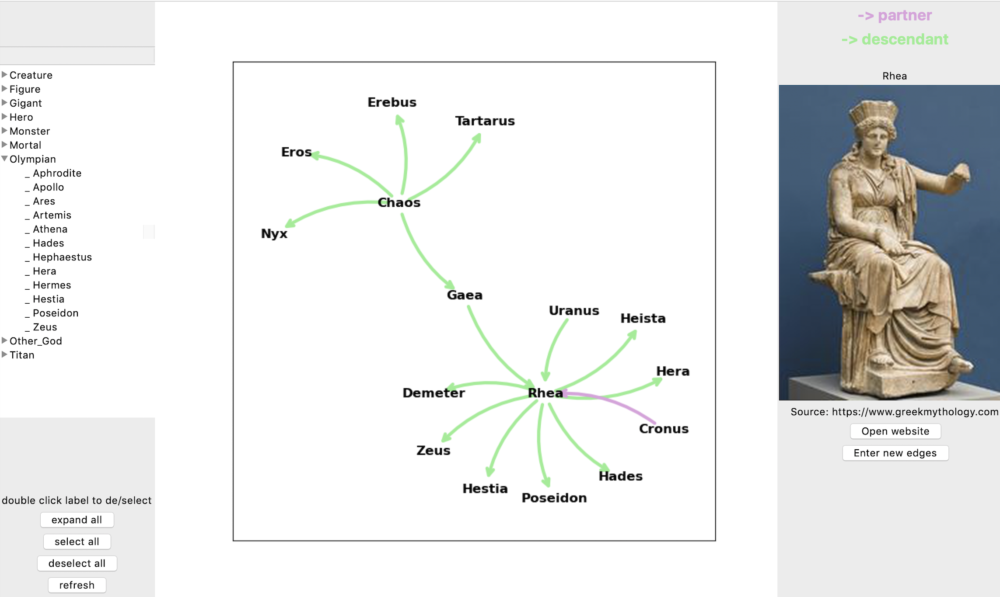

# GMN - Greek Mythology Network

Data in `assets/nodes.csv` and `assets/edges.csv` has been obtained from https://www.greekmythology.com and https://en.wikipedia.org/wiki/Family_tree_of_the_Greek_gods.
Images that are presented in the GUI are loaded from https://www.greekmythology.com.

To install this package, run: 
`pip install gmn`